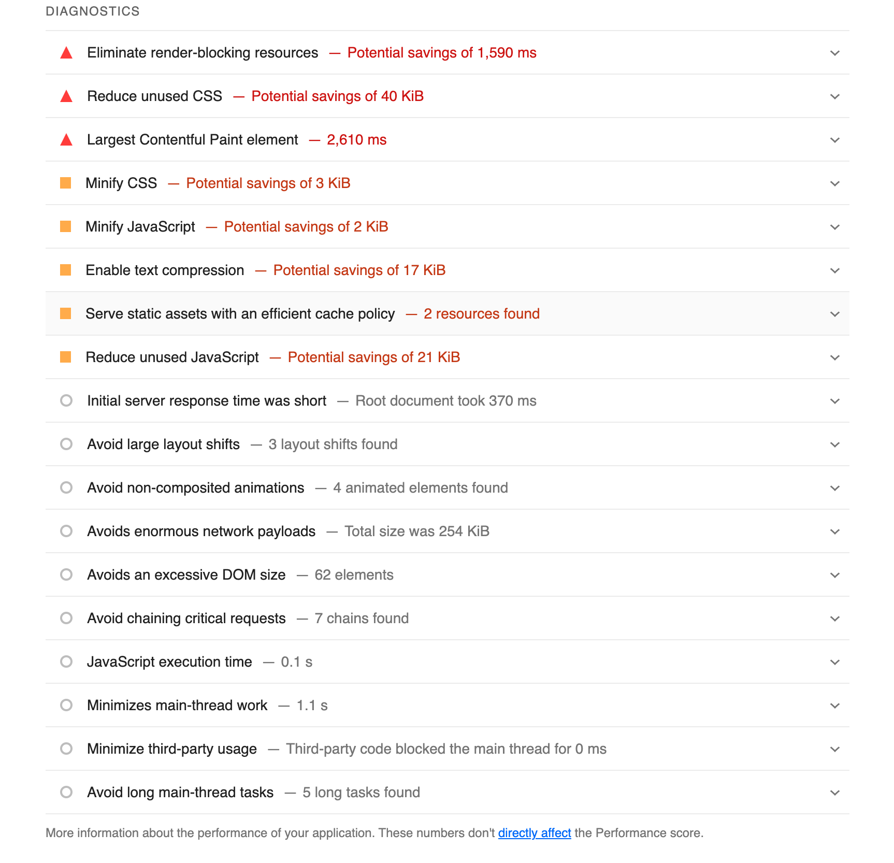
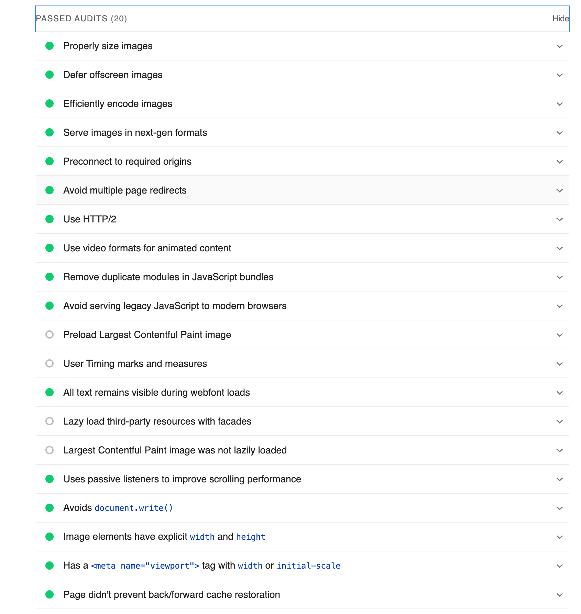

**

  

# Bonk It 🎮

  

**

  

  
  

---

**Live Site**

https://bonk-it-4b634a86c337.herokuapp.com/

 
**Repository**

https://github.com/charlottedinsdale/Final-Hackathon

 ---

📖 **Introduction**

Bonk It is a fun, easy-to-play game testing your reflexes and thinking by challenging you to press on instructed colors.

Perfect for quick gaming sessions and brain training.

  

---

🎯 **Target Audience**

The game is designed for anyone who wants to enjoy a simple yet engaging game.

Players seeking an extra challenge can try the advanced mode, which tests both reflexes and cognitive processing using the 'Stroop Effect' - a psychological phenomenon where the brain experiences conflict between processing the meaning of a word and the color in which it's written.

For example, if the word "Red" appears in blue ink and you need to press the button corresponding to the word (Red), your brain must resolve the conflict between the word's meaning and its visual color.

---

⭐ **Features**.  

**Core Features**

The core features of the game are summarised below :

- User authentication (register, login, logout)

- Customizable user profiles

- Global leaderboards

- Personal statistics tracking

- Multiple difficulty levels

- Audio feedback and game music. 

**Game Modes**

There are 3 games modes.

- Easy Mode: Basic color matching gameplay. The prompt states the colour and is in the colour you need to hit.

- Hard Mode: Increased difficulty with faster timing. The prompt only states the colour you need to hit.

- Heck Mode: Advanced gameplay incorporating the 'Stroop Effect' whereby the prompt states the colour you need to hit whilst itself being in another colour.   

---
**Instructions on How to Play**.  

Screenshots below are a guide to how to play the game.  

. 

. 

. 

. 

. 

. 

**Project Ideationn, Scoping & Planning**. 

The project ideation and scoping was done on Miro.  

Agile project planning and management practices (KANBAN board) was used on GitHub.  

  
Wireframes were designed on Miro  
  

The colour scheme was intended to be bright with a fun arcade effect.
Secondary colours were intended for colour blind players.  

---
**Database Schema**.   

A entity relstionship diagram was made to organise the database entities and their relationships to each other.   

  

---

💫 **Technologies Used**
Front and backend technologies used are listed below.
  

Languages

- HTML5

- CSS3

- JavaScript

- Python 3

  
  

Frameworks & Libraries

- Django

- Bootstrap

  
  

Database

- PostgreSQL

  
  

Tools

- Git

- GitHub

- Heroku

- Miro (Project Ideation & Scoping, Wireframes)

- Cloudinary

- ChatGPT

- Perplexity.

  
---

🧪 **Testing**

  

*Validation*

  

HTML - W3C HTML Validator.  
HTML validation higlighted some minor errors and warnings whihc with limited time were left.

  

CSS - W3C CSS Validator.  

  

Python
Flake8 extension was used whilst coding to linter the code. 
  

JavaScript - JSHint.  
  
    
Performance Testing
Performance testing was done using Google Lighthouse.  
A score of. 93 was recorded.   
  
. 

. 

. 

  
  
**Manual Testing**
# Test Report

This document outlines the test results for the game, including the performance, functionality, and responsiveness across various scenarios.

## Test Results
*see category descriptions below 

| **Category**       | **Pass/Fail** | **Issues Found**                                                                                         | **Notes**                                                                                          |
|---------------------|---------------|---------------------------------------------------------------------------------------------------------|----------------------------------------------------------------------------------------------------|
| **Initial Load**    | PASS          | None                                                                                                    | Page loads quickly and correctly, all elements visible, correctly positioned and aligned.                                 |
| **Game Start**      | PASS          | None                                                                                                   |                                                                                                                                       |
| **Scoring**         | PASS          | None                                                                                                    | Score system works correctly, updates scoreboard                                                  |                                                                                                                         |
| **Game End**        | PASS          | None                                                                                                    | Clean game end, score displayed correctly                                                        |
| **Responsive**      | PASS       |  None                    |   Tested across mobile and desktop                                                                                                  |
| **Browsers**        | PASS       | None           |  Tested on Chrome and Safari                                                                                                  |
| **Performance**     | PASS          | None                                                                                                   | No signs of delayed latency                                                                 |
| **Error-Handling**  | PASS          | None                                                                                                                                                                           |

### Category Descriptions

**Initial Load**  
   Refers to how the game behaves when first accessed or loaded in the browser. It checks whether the page loads quickly, elements are rendered properly, and the layout appears as intended.

**Game Start**  
   Evaluates the functionality when starting a new game, including whether the timer begins as expected and the initial game mechanics are triggered without delays or errors.

**Scoring**  
   Checks the scoring system to ensure that points are awarded or deducted correctly based on user actions and that the score updates instantly on the screen.

**Game End**  
   Examines the behavior when the game ends, ensuring a clean transition to the end screen, displaying the final score accurately, and handling game termination smoothly.

**Responsive**  
   Evaluates how well the game adapts to different screen sizes and devices, particularly mobile devices. It checks if the layout is user-friendly and functional across various resolutions.

**Browsers**  
   Ensures compatibility and consistent performance across different web browsers (e.g., Chrome, Firefox, Safari). It identifies browser-specific issues like animation lag or interaction problems.

**Performance**  
   Tests the game’s overall responsiveness and speed, especially under varying network conditions or on devices with slower processing power.

**Error Handling**  
    Assesses how well the game manages unexpected errors or invalid inputs, ensuring that issues do not crash the game or disrupt the user experience.

## Summary

- Core functionalities are working as intended.
- Scoring and error handling are robust and reliable.

---

🔜 **Future Features**

  

- Platform-specific timing adjustments for mobile/desktop taking into account that the desktop users play using a mouse or keyboard whilst mobile users play using their hands

  

- Millisecond precision time indicator

- A player can Toggle colorblind mode and be competitive with non-colorblind users. 

- Players can choose a theme they can play to with varying sound effects and colour schemes.  

- A leader board search facility so that players can keep pace of other players scores mroe closely. 

- A 'progress bar timer' so players can see the rate at which  time is depleting and can panic more / feel more thrill / have more fun. 
  

---

📘 **Credits**

  

***Team 'Bonkers'***

  

Adam Swanick

Charlotte Dinsdale

Joe Sutherland

Rabinder Singh

  

---

**Acknowledgements**

  

*Specific code used from Perplexity*

  

document.getElementById('start-button').addEventListener(

  

'click', function() {

  

fetch('/game/increment-total-games/',

  

{

  

method: 'POST',

  

headers: {

  

'Content-Type': 'application/json',

  

'X-CSRFToken': getCookie('csrftoken')

  

// Include CSRF token if using Django

  

}

  

})

  

.then(response => response.json())

  

.then(data => {

  

console.log('Total games incremented:',

  

data.total_games);

  

// Optionally update the UI to reflect the new

  

})

  

.catch(error => {

  

console.error('Error:', error);

  

});

  

});

  

  

// Function to get CSRF token (if using Django)

  

function getCookie(name) {

  

const cookieValue = document.cookie.split('; ').

  

find(.

  

row => row.startsWith(name + '='));

  

return cookieValue ? decodeURIComponent(.

  

cookieValue.split('=')[1]) : null;

  

}

  

---

**Tools & Resources**

  

Code Institute

Bootstrap

Font Awesome

Google Fonts

  
  

---

⭐ Star us on GitHub — it helps!